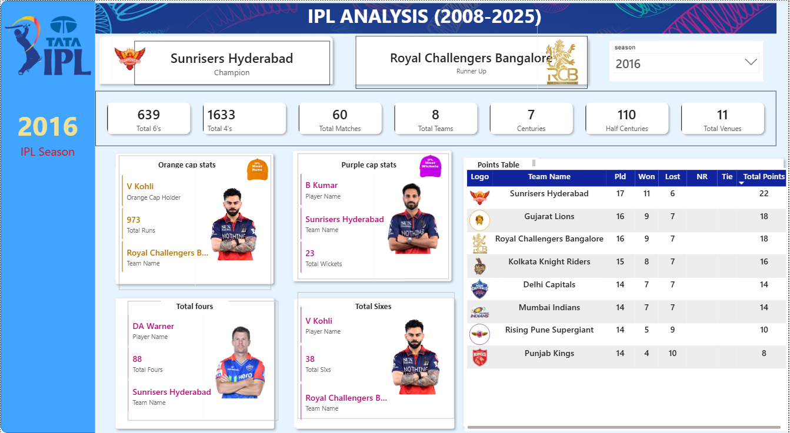
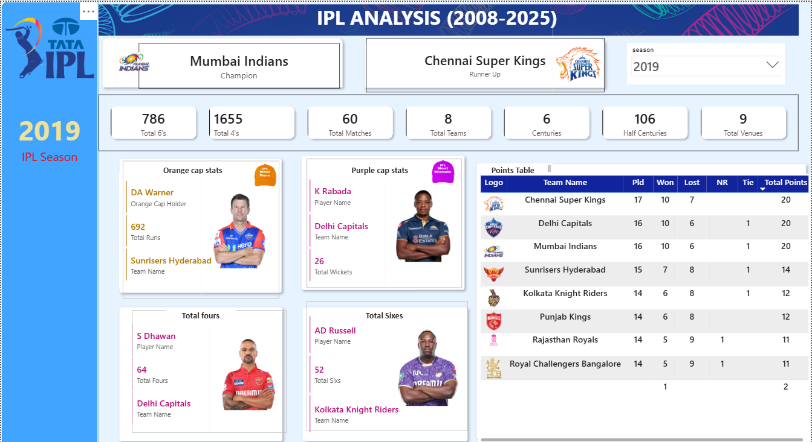
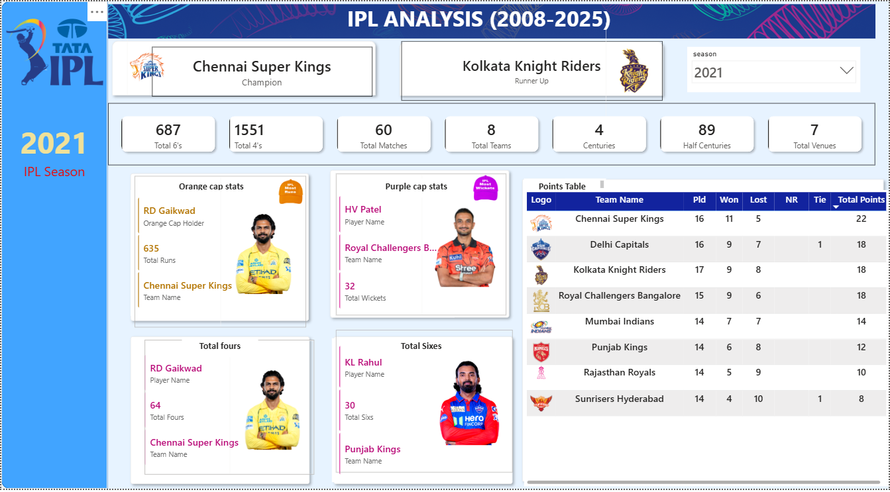
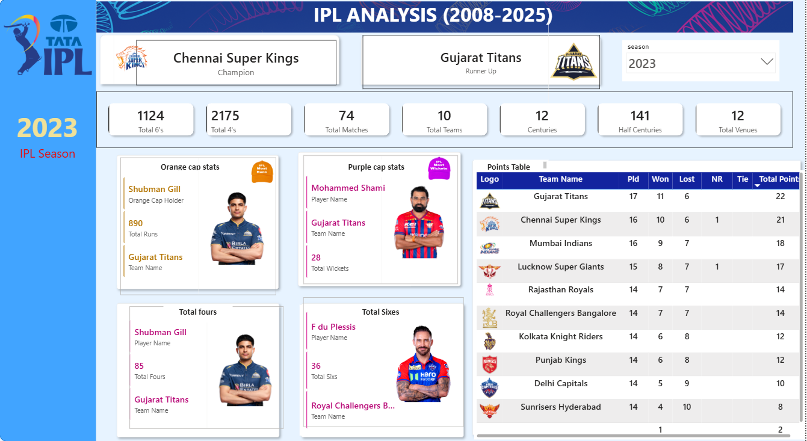
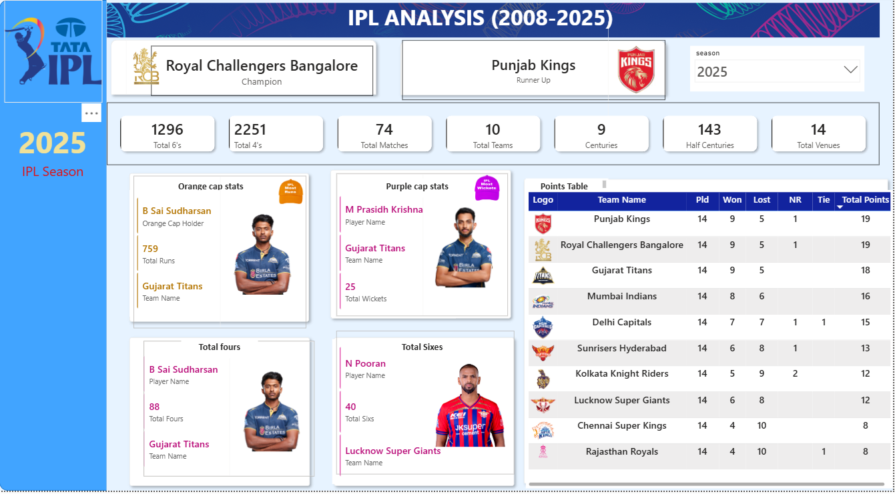

```md id="v8m2q4"
# 🏏 IPL Analysis Dashboard – Power BI Project

## 📌 Project Overview
This project is an interactive IPL (Indian Premier League) Analysis Dashboard built using **Power BI** and **DAX**.

The dashboard provides detailed insights into:
- Team performance
- Season winners
- Orange Cap & Purple Cap analysis
- Points table
- Match statistics
- Boundary analysis
- Venue analysis
- Player performance

---

# 📊 Dashboard Features

## ✅ Overview Analysis
- Total Matches
- Total Teams
- Total Venues
- Total 4’s & 6’s
- Centuries & Half Centuries

---

## 🟠 Orange Cap Analysis
- Orange Cap Holder
- Orange Cap Runs
- Team Name
- Player Image

---

## 🟣 Purple Cap Analysis
- Purple Cap Holder
- Wicket Count
- Team Name
- Player Image

---

## 📈 Team Performance Analysis
- Matches Played
- Matches Won
- Matches Lost
- Tie Matches
- No Result Matches
- Total Points

---

## 🏆 Season Insights
- Season Winner
- Runner-Up Team
- Team Logos
- Dynamic Season Filtering

---

# 🛠 Tools & Technologies Used

- Power BI
- DAX (Data Analysis Expressions)
- CSV Dataset
- Data Modeling
- Interactive Visualizations

---

# 📂 Files Included

| File Name | Description |
|---|---|
| `ipl dashboard project.pbix` | Main Power BI dashboard |
| `ipl_matches_data.csv` | IPL matches dataset |
| `ball_by_ball_data.csv.gz` | Ball-by-ball IPL data |
| `players-data-updated.csv` | Player images & details |
| `2008_Dashboard.png` | Dashboard screenshot |
| `2016_Dashboard.png` | Dashboard screenshot |
| `2019_Dashboard.png` | Dashboard screenshot |
| `2021_Dashboard.png` | Dashboard screenshot |
| `2023_Dashboard.png` | Dashboard screenshot |
| `2025_Dashboard.png` | Dashboard screenshot |

---

# 📸 Dashboard Preview

## 2008 Dashboard
(2008_Dashboard.png)](https://github.com/Vicky89485/IPL-Analysis-PowerBI/blob/main/2008_Dashboard.png)

## 2016 Dashboard


## 2019 Dashboard


## 2021 Dashboard


## 2023 Dashboard


## 2025 Dashboard


---

# 📌 Key DAX Concepts Used

- CALCULATE()
- FILTER()
- SUMMARIZE()
- LOOKUPVALUE()
- USERELATIONSHIP()
- SELECTEDVALUE()
- MAXX()
- COUNTROWS()
- DISTINCTCOUNT()
- ISBLANK()

---

# 🚀 Author

**Arigella Vijay Kumar**

- LinkedIn: linkedin.com/in/arigella-vijay-kumar-891a802a7

---

# ⭐ Project Status

Completed ✅
```
